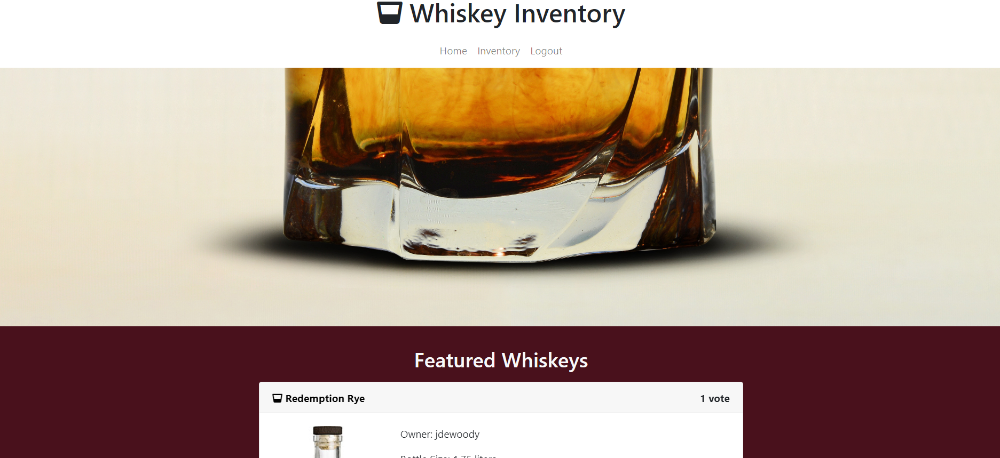

<h1 align="center">Whiskey Inventory 🍸</h1>
  
<p align="center">
    
    
    
    
</p>
  
<p align="center">
    
    
    
    
    
    
</p>

## Table of Contents
- [Table of Contents](#table-of-contents)
- [Description](#description)
- [User Story](#user-story)
- [Acceptance Criteria](#acceptance-criteria)
- [Installation](#installation)
- [Usage](#usage)
- [Testing](#testing)
- [Contributing](#contributing)

## Description

🔍 A whiskey app made using node.js, express.js, mySQL, Sequelize ORM and handlebars.js that allows users to track their inventory of collected whiskeys and socially interact with other whiskey lovers
  


## User Story

```
As a collector of quality whiskey, I want to track my collection, add personal observations to the catalogue, share my collection with others, and search for rare bottles to add to my collection.
```

## Acceptance Criteria

```
Use Node.js and Express.js to create a RESTful API.
Use Handlebars.js as the templating engine.
Use MySQL and the Sequelize ORM for the database.
Have both GET and POST routes for retrieving and adding new data.
Be deployed using Heroku (with data).
Use at least one new library, package, or technology that we haven’t discussed.
Have a polished UI.
Be responsive.
Be interactive (i.e., accept and respond to user input).
Have a folder structure that meets the MVC paradigm.
Include authentication (express-session and cookies).
Protect API keys and sensitive information with environment variables.
Have a clean repository that meets quality coding standards (file structure, naming conventions, follows best practices for class/id naming conventions, indentation, quality comments, etc.).
Have a quality README (with unique name, description, technologies used, screenshot, and link to deployed application).
```

## Installation
💾   
  
`npm init`

`npm install`

Dependencies: express, express-handlebars, express-session, mysql2, sequelize, [nodemon](https://www.npmjs.com/package/nodemon), dotenv, connect-session-sequelize, bcrypt, [mocha](https://mochajs.org/), chai, [lodash](https://www.npmjs.com/package/lodash), [request](https://www.npmjs.com/package/request), animate.css
  
## Usage
💻   
  
Run the following command at the root of your project and answer the prompted questions:

`mysql -u root -p`

Enter PW when promted

`source db/schema.sql`

`quit`

`npm run seed`
  
`npm start`

To run localhost with Nodemon:

`npm run watch`

## Testing
✏️

Testing will be implemented (future development) with [Mocha](https://mochajs.org/)

## Contributing
✉️ Contact us with any questions ❓: 
:octocat: [Andy Sanchez](https://github.com/AndySanchez726)
:octocat: [Chris Short](https://github.com/durcoorigin)
:octocat: [Joseph DeWoody](https://github.com/jpd61)
