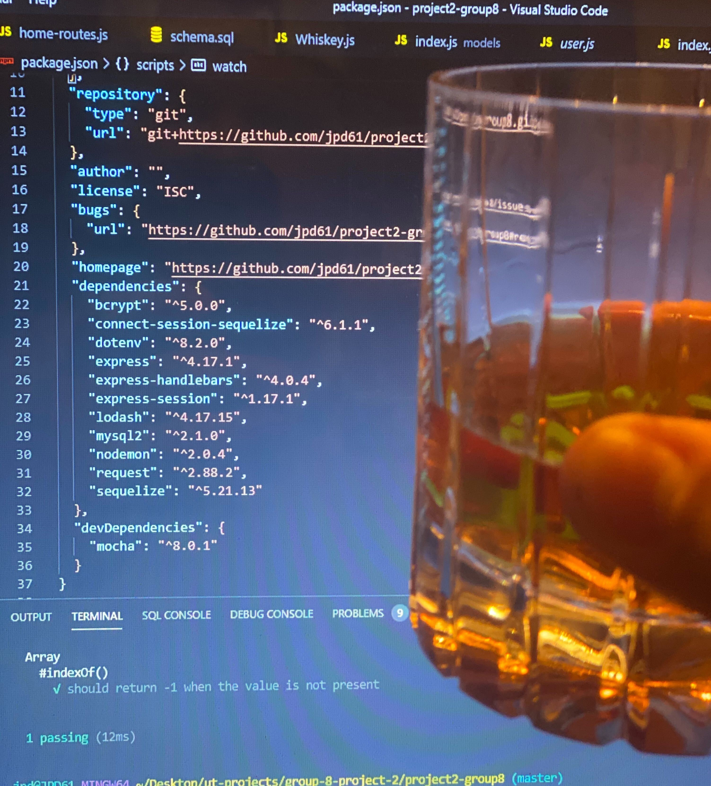

<h1 align="center">Whiskey Inventory 👋</h1>
  
<p align="center">
    
    
    
    
</p>
  
<p align="center">
    
    
    
    
    
    
</p>

## Table of Contents
- [Table of Contents](#table-of-contents)
- [Description](#description)
- [User Story](#user-story)
- [Acceptance Criteria](#acceptance-criteria)
- [Installation](#installation)
- [Usage](#usage)
- [Testing](#testing)
- [Contributing](#contributing)

## Description

🔍 A whiskey app....
  


## User Story

```
PLACEHOLDER
```

## Acceptance Criteria

```
PLACEHOLDER
```

## Installation
💾   
  
`npm init`

`npm install`

Dependencies: express, express-handlebars, express-session, mysql2, sequelize, [nodemon](https://www.npmjs.com/package/nodemon), dotenv, connect-session-sequelize, bcrypt, [mocha](https://mochajs.org/), chai, [lodash](https://www.npmjs.com/package/lodash), [request](https://www.npmjs.com/package/request)
  
## Usage
💻   
  
Run the following command at the root of your project and answer the prompted questions:

`mysql -u root -p`

Enter PW when promted

`source db/schema.sql`

`quit`

`npm run seed`
  
`npm start`

To run localhost with Nodemon:

`npm run watch`

## Testing
✏️

Testing will be implemented with [Mocha](https://mochajs.org/)

## Contributing
✉️ Contact us with any questions: 
:octocat: [Andy Sanchez](https://github.com/AndySanchez726)
:octocat: [Chris Short](https://github.com/durcoorigin)
:octocat: [Joseph DeWoody](https://github.com/jpd61)
